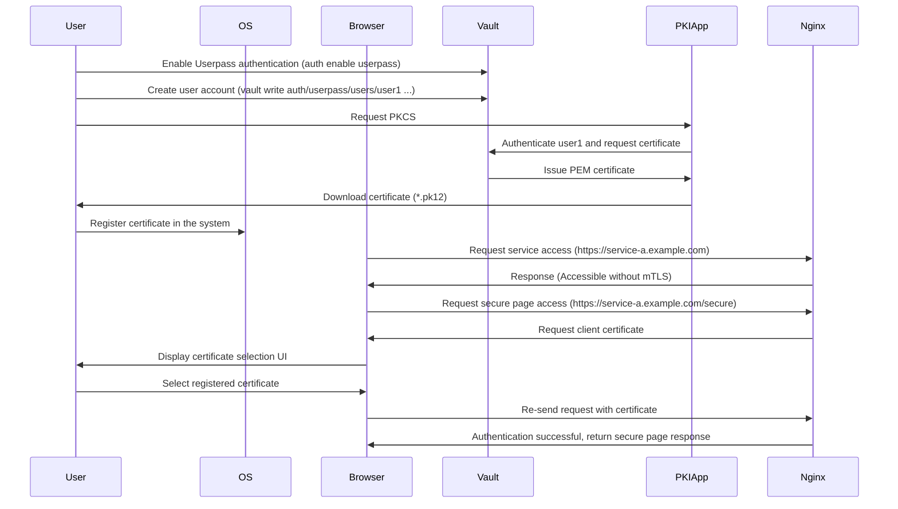

# Vault PKI Demo - Browser Authentication



## Prerequisites

The following installations and runtime environment are required:

- The system must support Vault, Nomad, and Docker.
  - Install Vault: <https://developer.hashicorp.com/vault/install?product_intent=vault>
  - Install Nomad: <https://developer.hashicorp.com/nomad/install?product_intent=nomad>
- Python 3 and required packages (`flask`, `hvac`, `cryptography`) must be installed.
- A Unix-like environment where `export` commands can be executed.

## 1. Setup Environment Variables

Set the following in your terminal:

```bash
export NOMAD_ADDR='http://127.0.0.1:4646'
export VAULT_ADDR='http://127.0.0.1:8200'
export VAULT_TOKEN=root
export NOMAD_POLICY=nomad-server
```

## 2. Run Vault

Run in a separate terminal:

```bash
vault server -dev -dev-listen-address=0.0.0.0:8200 -dev-root-token-id=$VAULT_TOKEN
```

## 3. Setup Vault PKI

```bash
vault secrets enable pki
vault secrets tune -max-lease-ttl=87600h pki
vault write pki/root/generate/internal \
  key_bits=2048 \
  private_key_format=pem \
  signature_bits=256 \
  country=KR \
  province=Seoul \
  locality=KR \
  organization=COMPANY \
  ou=DEV \
  common_name=example.com \
  ttl=87600h
vault write pki/config/urls \
  issuing_certificates="http://127.0.0.1:8200/v1/pki/ca" \
  crl_distribution_points="http://127.0.0.1:8200/v1/pki/crl"
vault write pki/roles/example-dot-com \
  allowed_domains=example.com \
  allow_subdomains=true \
  max_ttl=72h
vault write pki/roles/user-auth \
  allowed_domains=example.com \
  allow_subdomains=true \
  client_flag=true \
  max_ttl=72h
vault policy write pki_policy - <<-EOF
  path "pki/issue/*" {
    capabilities = [ "create", "read", "update", "delete", "list", "sudo" ]
  }
EOF
```

## 4. Vault Policy & Token for Nomad

```bash
cat <<EOF | vault policy write $NOMAD_POLICY -
path "auth/token/create/nomad-cluster" {
  capabilities = ["update"]
}

path "auth/token/roles/nomad-cluster" {
  capabilities = ["read"]
}

path "auth/token/lookup-self" {
  capabilities = ["read"]
}

path "auth/token/lookup" {
  capabilities = ["update"]
}

path "auth/token/revoke-accessor" {
  capabilities = ["update"]
}

path "sys/capabilities-self" {
  capabilities = ["update"]
}

path "auth/token/renew-self" {
  capabilities = ["update"]
}
EOF
```

## 5. Run Nomad with Vault Token

Run in a separate terminal:

```bash
vault write auth/token/roles/nomad-cluster allowed_policies="pki_policy" disallowed_policies="$NOMAD_POLICY" token_explicit_max_ttl=0 orphan=true token_period="259200" renewable=true
vault token create -field token -policy $NOMAD_POLICY -period 72h -orphan > /tmp/token.txt
nomad agent -dev -vault-enabled=true -vault-address=http://127.0.0.1:8200 -vault-token=$(cat /tmp/token.txt) -vault-tls-skip-verify=true -vault-create-from-role=nomad-cluster
```

## 6. Setup Vault Userpass

```bash
vault auth enable userpass
vault write auth/userpass/users/user1 password=password policies=pki
```

## 7. Run Nginx on Nomad with mTLS Configuration

```bash
nomad job run nginx.job.hcl
```

## 8. Configure `hosts` File and Test in Browser

```bash
echo "127.0.0.1   service-a.example.com" >> /etc/hosts
```

Click (Allow): [https://service-a.example.com](https://service-a.example.com)  
Click (Deny): [https://service-a.example.com/secure](https://service-a.example.com/secure)

## 9. Get PKCS#12 Client Key

Run inside `pk12-app`:

```bash
python -m pip install flask hvac cryptography
```

[Get PKCS#12 Certificate](http://127.0.0.1:8888)

Enter the previously created Vault userpass credentials (`user1` as username and `password` as password), then set a password for the certificate. The application will retrieve the PEM certificate from Vault, convert it to a PKCS#12 certificate, and prompt the user to download it.

After downloading the `*.pk12` file, register it in the system.

## 10. Access the SSL Client Verification Page

Click: [https://service-a.example.com/secure](https://service-a.example.com/secure)

When accessing this page, a UI will prompt you to select a registered certificate for `example.com`. After registering and retrying access, the page should load successfully.
