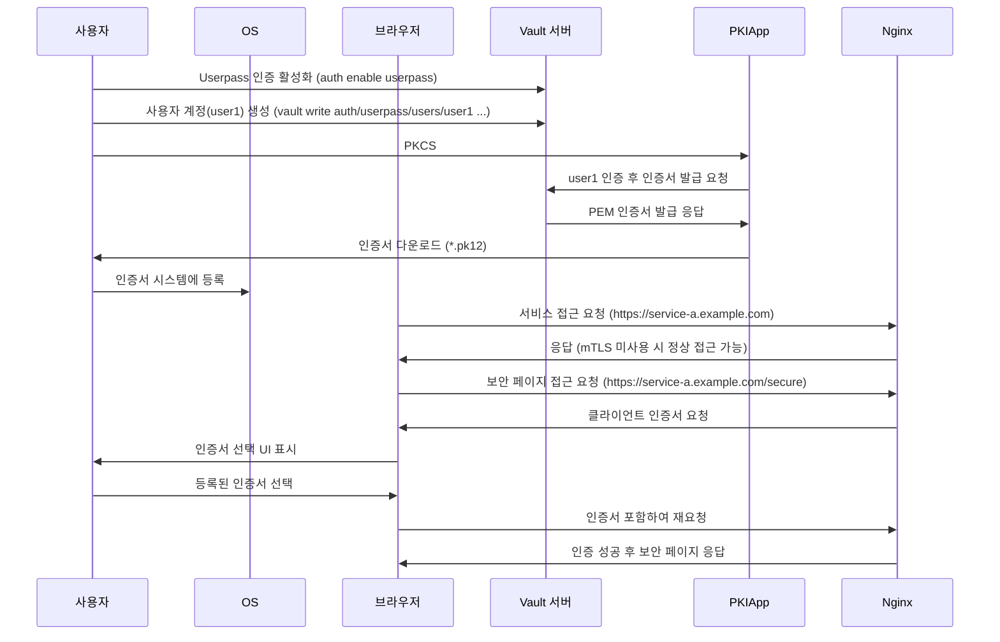

# Vault PKI Demo - Browser auth



## 준비사항

필수 설치 및 실행 환경은 다음과 같습니다.

- Vault, Nomad, Docker가 실행가능한 환경이여야 합니다.
  - Install Vault - <https://developer.hashicorp.com/vault/install?product_intent=vault>
  - Install Nomad - <https://developer.hashicorp.com/nomad/install?product_intent=nomad>
- Python 3 및 필요한 패키지 (flask, hvac, cryptography)를 설치해야 합니다.
- export 명령어를 실행할 수 있는 Unix-like 환경이 필요합니다.

## 1. Setup ENV

명령어를 실행할 터미널에서 다음을 설정합니다.

```bash
export NOMAD_ADDR='http://127.0.0.1:4646'
export VAULT_ADDR='http://127.0.0.1:8200'
export VAULT_TOKEN=root
export NOMAD_POLICY=nomad-server
```

## 2. Run Vault

다른 창에서 실행

```bash
vault server -dev -dev-listen-address=0.0.0.0:8200 -dev-root-token-id=$VAULT_TOKEN
```

## 3. Setup Vault PKI

```bash
vault secrets enable pki
vault secrets tune -max-lease-ttl=87600h pki
vault write pki/root/generate/internal \
  key_bits=2048 \
  private_key_format=pem \
  signature_bits=256 \
  country=KR \
  province=Seoul \
  locality=KR \
  organization=COMPANY \
  ou=DEV \
  common_name=example.com \
  ttl=87600h
vault write pki/config/urls \
  issuing_certificates="http://127.0.0.1:8200/v1/pki/ca" \
  crl_distribution_points="http://127.0.0.1:8200/v1/pki/crl"
vault write pki/roles/example-dot-com \
  allowed_domains=example.com \
  allow_subdomains=true \
  max_ttl=72h
vault write pki/roles/user-auth \
  allowed_domains=example.com \
  allow_subdomains=true \
  client_flag=true \
  max_ttl=72h
vault policy write pki_policy - <<-EOF
  path "pki/issue/*" {
    capabilities = [ "create", "read", "update", "delete", "list", "sudo" ]
  }
EOF
```

## 4. Vault Policy & Token for Nomad

```bash
cat <<EOF | vault policy write $NOMAD_POLICY -
path "auth/token/create/nomad-cluster" {
  capabilities = ["update"]
}

path "auth/token/roles/nomad-cluster" {
  capabilities = ["read"]
}

path "auth/token/lookup-self" {
  capabilities = ["read"]
}

path "auth/token/lookup" {
  capabilities = ["update"]
}

path "auth/token/revoke-accessor" {
  capabilities = ["update"]
}

path "sys/capabilities-self" {
  capabilities = ["update"]
}

path "auth/token/renew-self" {
  capabilities = ["update"]
}
EOF
```

## 5. Run Nomad with Vault Toekn

다른 창에서 실행

```bash
vault write auth/token/roles/nomad-cluster allowed_policies="pki_policy" disallowed_policies="$NOMAD_POLICY" token_explicit_max_ttl=0 orphan=true token_period="259200" renewable=true
vault token create -field token -policy $NOMAD_POLICY -period 72h -orphan > /tmp/token.txt
nomad agent -dev -vault-enabled=true -vault-address=http://127.0.0.1:8200 -vault-token=$(cat /tmp/token.txt) -vault-tls-skip-verify=true -vault-create-from-role=nomad-cluster
```

## 6. Setup Vault Userpass

```bash
vault auth enable userpass
vault write auth/userpass/users/user1 password=password policies=pki
```

## 7. Nginx run on Nomad with mTLS configuration

```bash
nomad job run nginx.job.hcl
```

## 8. Set `hosts` file and browser check

```bash
echo "127.0.0.1   service-a.example.com" >> /etc/hosts
```

click(allow) : [https://service-a.example.com](https://service-a.example.com)

click(deny) : [https://service-a.example.com/secure](https://service-a.example.com/secure)

## 9. Get pkcs12 client key

`₩pk12-app` 에서 실행한다.

```bash
python -m pip install flask hvac cryptography
```

[Get pk12 page](http://127.0.0.1:8888)

앞서 생성한 Vault userpass 인증의 username인 `user1`과 password인 `password`를 입력하고, 인증서용 비밀번호를 입력하면 Vault로 부터 PEM인증서를 받아 pkcs#12 인증서로 변환 후 다운로드가 진행된다.

다운로드 받은 *.pk12 파일을 시스템에 등록한다.

## 10. Go to ssl_client_verify location

click : [https://service-a.example.com/secure](https://service-a.example.com/secure)

해당 페이지로 접근하면 시스템에 등록된 `example.com`용 인증서를 선택하는 UI가 표시된다.

등록 후 다시 접근하면 정상적으로 표기된다.